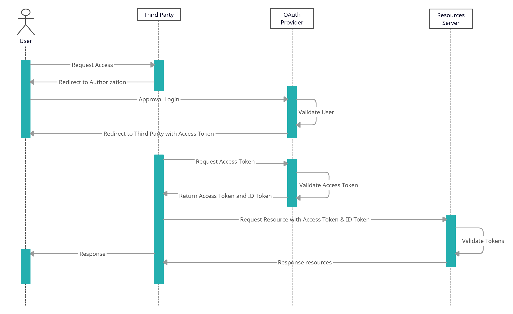

# OAuth and OpenID Connect
OAuth 2.0 is an authorization protocol provide methods to allow `client` obtain access to protected resource which owned by `Resource Owner`.

## How OAuth 2.0 Works


### Defination
* User(Resource Owner) is an entity that holds an access-restricted resource and decides who is allowed to access the resource. It can be Person, software, device etc.
* Thrid Party(Client) is an entity that needs to gain access to the resource owned by nother `entity`.
* OAuth provider is a server responsible for provide (Access token, ID Token) to client
* Resource Server is place where `User` protected resources where stored. It act It is the guardian of the protected resource and can be only accessed when  access token provided.

### Process of OAuth 2.0
1. User request third party to help him to process some request.
2. Authorization Request Redirect: Third party request authorization from user, so it responsed a redirect Uri to OAuth provider for authentication.
3. Authorization Request: User authenticate himself by sending credential to OAuth Provider.
4. Authorization Response: OAuth provider validate user credential and send back `Authentication Token` with `redirect url` if credential calidate success.
5. Access Token Request: Send the Token to the Application: Client request `Access Token` from OAuth provider
6. Access Token Response: OAuth provider validate `Authentication Token` and send `Access Token` back on if Authentication Token is valid.
7. Client use the `Access Token` to request any resources that is needed.

### The need of authorization code exchange for access token instead of obtaining the access token directly?
1. User is redirected to OAuth provider, so connection between Third Party and User is disconnected. So even Third Party gained access, it cannot provide services to User. There with with this redirect User and Client can re-established connection


## Authorization Code issuing process
1. When OAuth server received request from Third Party. Some validations are required before respond credential page to the user.
```c#
// Check the request is for Authorization Code 
if(!string.Equals("code", model.responseType))
{
    // Invalid Request
}

// Validate the client is registered
var client = clients.getClientOrNull(model.client_id)
if (client == null)
{
    // Unknow Client, reject   
}

// Validate request redirectUri is in registered redirectUris
if (!client.redirectUris.Contain(model.redirectUri))
{
    // Wrong redirectUri, reject 
}

if (!checkScope(model.scopes))
{
    // Out of registered scopes, reject 
}

// return credential page to user
```
2. OAuth server received credential and approved scopes from user. OAuth server need to validate scope again to ensure `approved scopes` are in `requsted scopes`
```c#
if (!checkScope(model.scopes, loginModel.scopes))
{
    // Requested scopes are out of user approved scopes
}
```

```
// Validate request redirectUri is in registered redirectUris
if (!client.scopes.Contain(model.scopes))
{
    return Unauthorized()    
}

// Validate request redirectUri is in registered redirectUris
if (!client.redirectUris.Contain(model.redirectUri))
{
    return Unauthorized()    
}
```

## Access Token Issuance Flow