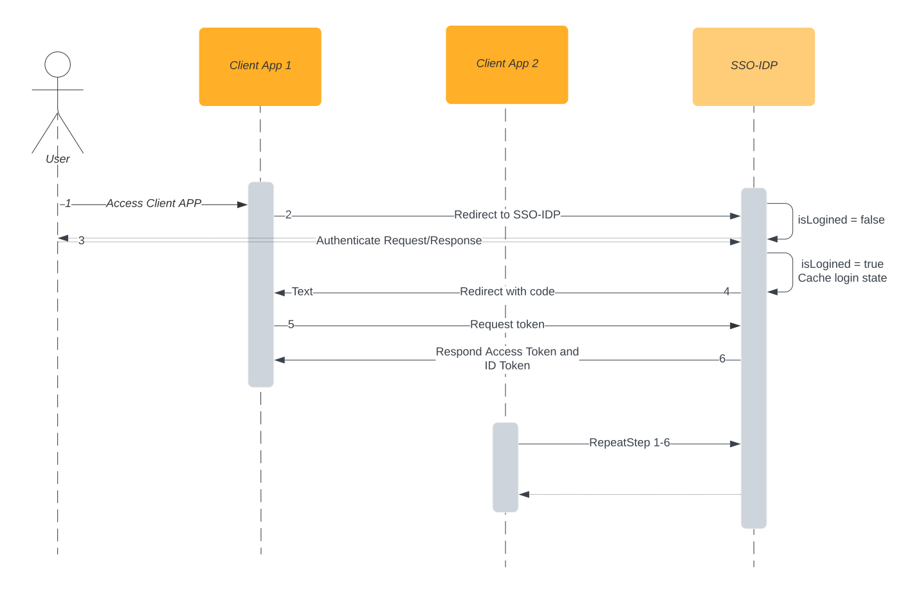

# OpenID Connect
OpenID Connect (OIDC) is an extenstion to OAuth2.0 protocol. It provides a standard way for user authentication and identity information to be exchanged securely between parties, such as a client application, an identity provider (IDP), and a resource server.

OpenID Connect allows a client application to verify the identity of a user by requesting authentication from a trusted IDP. The IDP authenticates the user and returns an ID token, which contains information about the user's identity, such as their name, email address, and other profile information. The client application can then use this information to provide personalized services and experiences for the user.

In addition to providing user authentication, OpenID Connect also supports single sign-on (SSO) and federation, allowing users to use their existing identity from one site or service to access multiple sites or services.

OpenID Connect is widely used for identity and access management in web and mobile applications, and is supported by many major identity providers, such as Google, Microsoft, and Okta. It is also used by organizations to provide secure and seamless access to enterprise resources and services.

# ID token encode and decode
ID token is a token is specified in JWT format, so itself is introspeciable. To identify a user, following 5 compuslary filed must specified in JWT.

| Parameter |      Description             |
|-----------|:-----------------------------|
| iss       | Stands for `issuer`: Token issuer, the value is the absoulte URL of the authentication server  |
| sub       | Stands for `subject`: Token subject, the value is a globally unique identifier that can represent the end user. |
| aud       | Stands for `audience`: Token audience, the value is the client id |
| exp       | Stands for `expiration`: Token expiring datetime |
| iat       | Stands for `issued at` The datetime at which the token was issued |

# Single Sign On
OpenID allows users to log in to multiple applications using only one set of login credentials and authenticate only once. Ultimately a better user login experience.

Basiacally in here, if an user is logined to SSO-IDP server once, his login information is cached in the OIDC server. For subsidiary applications to obtain access protected resources, it only need to perform the process from step 1 to 6 without user's interferance - as login crediential is cached OIDC server.

There is a problem here: if user access `subsidiary applications` without ID token, subsidiary applications cannot identify the user, so user need to authentication himself with OIDC server. Common solution is utlizeing `cooike` and `sessionid`.