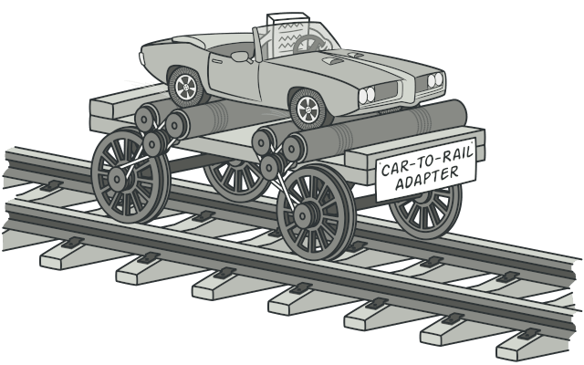

# Design Patterns
Design patterns are typical solutions to commonly occurring problems in software design and then describes the core of
the solution to that problem.

## Why Use Design Patterns?
`Reuse` - Once a design pattern has been verified, it can be used in any number of ways in a given context.

`Common Vocabulary` -  Design patterns define a common vocabulary that you and your teammates can use to communicate more efficiently

`Easy to modify` - Designs patterns are easy to modify to apply to a particular problem. The solutions can also be modified to give flexibility with minimal risk.

### `Reuse`
The main goal of reuse are:
1. Reuse knowledge from previous experience to current problem
2. Reuse functionality which is already available

Resue can be defined into two categories:
1. Composition (Black Box Reuse))
   * New functionality is obtained by aggregation
   * The new object with more functionality is an aggregation of existing components
2. Inheritance (White-Box Reuse)
   * New functionality is obtained by inheritance

When resuse old subsystem, if we need new functionality, then we can do it by:
1. Implementation inheritance
   1. Extend an applications’ functionality by reusing functionality in parent class
   2. Inherit from an existing class with some or all operations already implemented
2. Interface inheritance
   1. Inherit from an abstract class with all operations specified, but not yet implemented
3. Delegation
   1. allows object composition to achieve the same code reuse as inheritance.
   2. In Delegation two objects are involved in handling a request
      1. A receiving object delegates operations to its delegate.
      2. The developer can make sure that the receiving object does not allow the client to misuse the delegate object

## Implementation inheritance VS Interface inheritance

# Structural Design Patterns
Structural patterns explain how to assemble objects and classes into larger structures while keeping these structures flexible and efficient.

> A subsystem consists of `an interface object`, a set of application domain `objects` modeling real entities or existing systems and one or more control objects.

## Facade - Provides the interface to the subsystem
Facade is a structural design pattern that provides a `simplified interface` to a library, a framework, or any other complex set of classes.

#### Open vs Closed Architecture
Open architecture: Any client can see into the subsystem and call on any component or class operation. The advantage is Efficiency, but the subsystem will be misused.

Closed Architecture: The subsystem decides exactly how it is accessed. The advantage is No need to worry about misuse by callers 

## Adapter - Provides the interface to existing system
Adapter is a structural design pattern that allows objects with `incompatible interfaces to collaborate`.

There are two adapter patterns:
1. Class adapter - Uses multiple inheritance to adapt one interface to another
2. Object adapter - Uses single inheritance and delegation

## Bridge - Provides the interface to existing system
Bridge is a structural design pattern that lets you `split` a `large class` or a set of closely related classes `into` `two` `separate` `hierarchies—abstraction` and `implementation` which can be developed independently of each other.

To 

### Adapter vs Bridge
Both used to hide the details of the underlying implementation.

Adapter pattern is geared towards making unrelated components work together

Bridge, on the other hand, is used up-front in a design to let abstractions and implementations vary independently.

## Proxy pattern
Proxy is a structural design pattern that lets you provide a substitute or placeholder for another object. A proxy provide a class which will limit access to another class, such as allowing you to perform something either before or after the request gets through to the original object.

### Problem
You have a massive object that consumes a vast amount of system resources. You need it from time to time, but not always. But to create or initializa the object on need is very expensice. 

So we can defer object creation and object initialization to the time that you need the object. By Uses another object(proxy) that acts as a stand-in for the real object

### Proxy Applicability
Remote Proxy - Local execution of a remote service. This is when the service object is located on a remote server.

Virtual Proxy - used when object is too expensive to create or too expensive to download.

Protection Proxy - used when you want only specific clients to be able to use the service object

## Design Patterns encourage good Design Practice
A facade pattern should be used by all subsystems in a software system. The façade defines all the services of the subsystem.

Adapters should be used to interface to any existing
proprietary components.

Bridges should be used to interface to a set of objects where the full set is not completely known at analysis or design time.

### Why are modifiable designs important?
A modifiable design enables an iterative and incremental development cycle, like:
1. concurrent development 
2. risk management
3. flexibility to change

And minimizes the introduction of new problems when fixing
old ones

## What makes a design modifiable?
* Low coupling and high coherence
* Clear dependencies
* Explicit assumptions
* How do design patterns help?
* They are generalized from existing systems
* They provide a shared vocabulary to designers
* They provide examples of modifiable designs
  * Abstract classes
  * Delegation

# Reference
https://refactoring.guru/design-patterns/