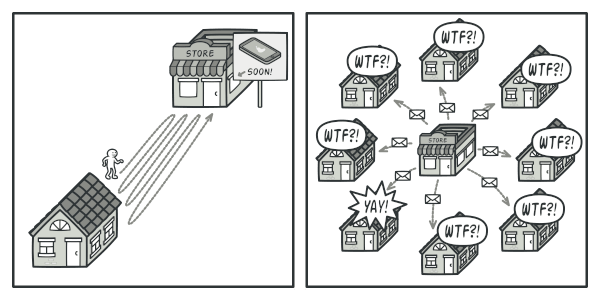

# Behavioral Pattern
Behavioral design patterns are concerned with algorithms and the assignment of responsibilities between objects.

## Observer
Observer is a behavioral design pattern that lets you define a subscription mechanism to notify multiple objects about any events that happen to the object they’re observing.

> Define a one-to-many dependency between objects so that when one object changes state, all its dependents are notified and updated automatically

### Problem
The customer is very interested in a particular brand of product which should become available in the store very soon.

The customer could visit the store every day and check product availability - `wastes time` checking product availability

Or the store could send tons of emails to all customers each time a new product becomes available - `spaming`



### Solution 
The Observer pattern suggests that you add a subscription mechanism to the publisher class so individual objects can subscribe to or unsubscribe from a stream of events coming from that publisher.


# Creational Design Patterns
Creational patterns provide various object creation mechanisms, which increase flexibility and reuse of existing code.

## Abstract Factory
Abstract Factory is a creational design pattern that lets you produce families of related objects without specifying their concrete classes.


Example illustrates how the Abstract Factory pattern can be used for creating cross-platform UI elements without coupling the client code to concrete UI classes, while keeping all created elements consistent with a selected operating system.

```java
interface GUIFactory is
    method createButton():Button
    method createCheckbox():Checkbox

class WinFactory implements GUIFactory is
    method createButton():Button is
        return new WinButton()
    method createCheckbox():Checkbox is
        return new WinCheckbox()

class MacFactory implements GUIFactory is
    method createButton():Button is
        return new MacButton()
    method createCheckbox():Checkbox is
        return new MacCheckbox()
```

## Summary
Structural Patterns
* Focus: How objects are composed to form larger structures
* Problems solved:
  * To realize new functionality from old functionality,
  * To provide flexibility and extensibility
Behavioral Patterns
* Focus: Algorithms and the assignment of responsibilities to objects
* Problem solved:
  * Overly tight coupling to a particular algorithm
Creational Patterns
* Focus: Creation of complex objects
* Problem solved:
  * Hide how complex objects are created and put together